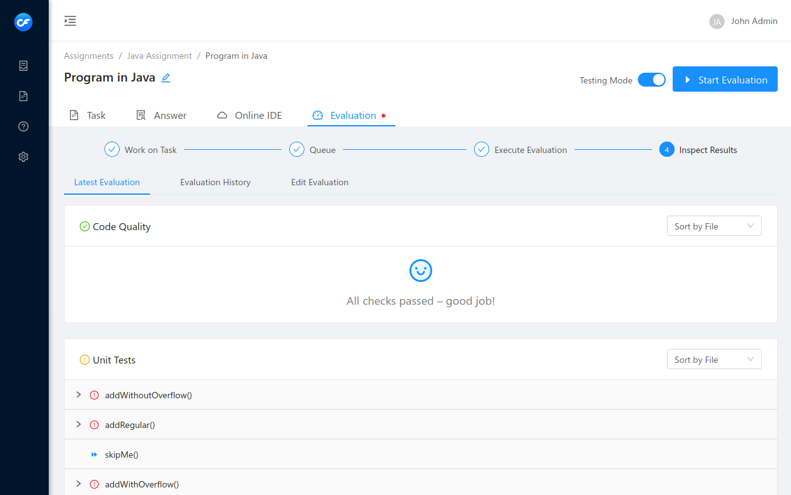

<p align="center">
    
</p>
<h1 align="center">Code FREAK</h1>


[](https://hub.docker.com/r/cfreak/codefreak)
[](https://www.gnu.org/licenses/agpl-3.0)
[](https://discord.gg/HYDQEDt)

Code FREAK (Code Feedback, Review & Evaluation Kit) is an online programming platform and evaluation/autograding system for coding assignments. It supports every major programming language (language agnostic) and has a modular evaluation system based on Docker.



## Main Features

- [x] Support for every major programming language (language agnostic)
- [x] Pluggable evaluation system based on Docker (Dynamic Testing, Linting, …)
- [x] In-browser IDE based on VSCode/[Coder](https://github.com/cdr/code-server)
- [x] Modern UI based on React and Ant Design
- [x] Integrates with learn management systems (LMS) via LTI 1.3 standard
- [x] LDAP authentication
- [x] 100% free and open source

## Installation

We currently only support installation via Docker. The image name is [`cfreak/codefreak`](https://hub.docker.com/r/cfreak/codefreak). Check out its [tags](https://hub.docker.com/r/cfreak/codefreak?tab=tags) for the latest version.

### Try with Docker 🐋

You can try out Code FREAK locally. The only requirement is a working installation of Docker on your computer.

```shell script
docker run -it --rm \
    -v /var/run/docker.sock:/var/run/docker.sock \
    -p 8080:8080 \
    cfreak/codefreak
```

The UI is accessible at http://localhost:8080.
Log in using `admin` and password `123`.

This will use you local Docker daemon for evaluation and IDE instances.

### Image variants

There are two major image versions on Docker Hub: `latest` and `canary`. `latest` always points to the latest stable release and `canary` is basically a snapshot release based on the `master` branch from GitHub.

Our image tags follow semantic versioning. For example the tag `cfreak/codefreak:4` will always reference the latest v4 release.

### Deployment & Configuration

Our Docker image should run without any further configuration. Out of the box it will use an in-memory database and the Docker daemon available via `/var/run/docker.sock` or the `DOCKER_HOST` environment variable. This is of course NOT suitable for production deployments. Please see our [installation/deployment guide](https://docs.codefreak.org/codefreak/for-admins/installation.html) for detailed instructions and recommendations.

## Documentation

The latest documentation is always available on [docs.codefreak.org](https://docs.codefreak.org). You can find the "raw" documentation files inside the [`/docs`](https://github.com/codefreak/codefreak/tree/master/docs) directory.

## State of the Project

The development of Code FREAK started in 2018. It has been used in production from an early stage on at [Kiel University of Applied Sciences](https://www.fh-kiel.de/) (Germany). Extensive testing in various computer science courses resulted in valuable feedback. The reception by studends and teachers is very positive.

While this is not a mature product yet, all major features (editing, evaluation, reviewing) do work already. We have many ideas for new features and the existing application still needs some polishing. Development is ongoing in cooperation with current users.

Code FREAK is intended to become a community-driven project. If you are interested in trying it for your educational institution or if you have any questions, feel free to get in touch with us! ✉ codefreak@fh-kiel.de

## Roadmap / Planned Features
There are still **A LOT** of features that have not been integrated into Code FREAK, yet.
You will find them in our [`ROADMAP.md`](./ROADMAP.md) file.

If your desired feature is missing please open an issue on GitHub!

## License

    Code FREAK | Code Feedback Review & Evaluation Kit
    Copyright (C) 2019 Kiel University of Applied Sciences

    This program is free software: you can redistribute it and/or modify
    it under the terms of the GNU Affero General Public License as published
    by the Free Software Foundation, either version 3 of the License, or
    (at your option) any later version.

    This program is distributed in the hope that it will be useful,
    but WITHOUT ANY WARRANTY; without even the implied warranty of
    MERCHANTABILITY or FITNESS FOR A PARTICULAR PURPOSE.  See the
    GNU Affero General Public License for more details.

    You should have received a copy of the GNU Affero General Public License
    along with this program.  If not, see <https://www.gnu.org/licenses/>.
